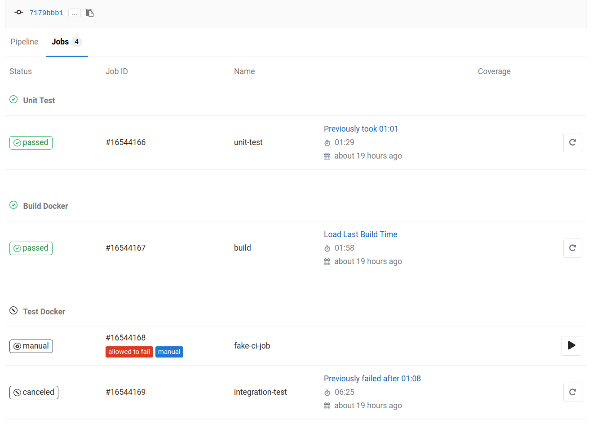

# GitLab Recent Job Time

Queries GitLab to determine how long a CI job took the last time it was run.

To ensure that the script doesn't create unneeded load on the GitLab API, the last build time will only be loaded when
you click on "Load Last Build Time".

## Installation

1. Install [TamperMonkey][]
2. Visit [gitlab-recent-job-time.user.js][]

TamperMonkey should prompt you to install the script.

The first time you load a build time, you will be prompted for an [API Token][].

The script will automatically update itself when new versions are released.  You may want to configure TamperMonkey's
update checking duration, as it may default to only check for updates once a week.

[TamperMonkey]: https://tampermonkey.net/
[gitlab-recent-job-time.user.js]: https://raw.githubusercontent.com/CodeLenny/gitlab-recent-job-time/master/gitlab-recent-job-time.user.js
[API Token]: https://gitlab.com/profile/personal_access_tokens
